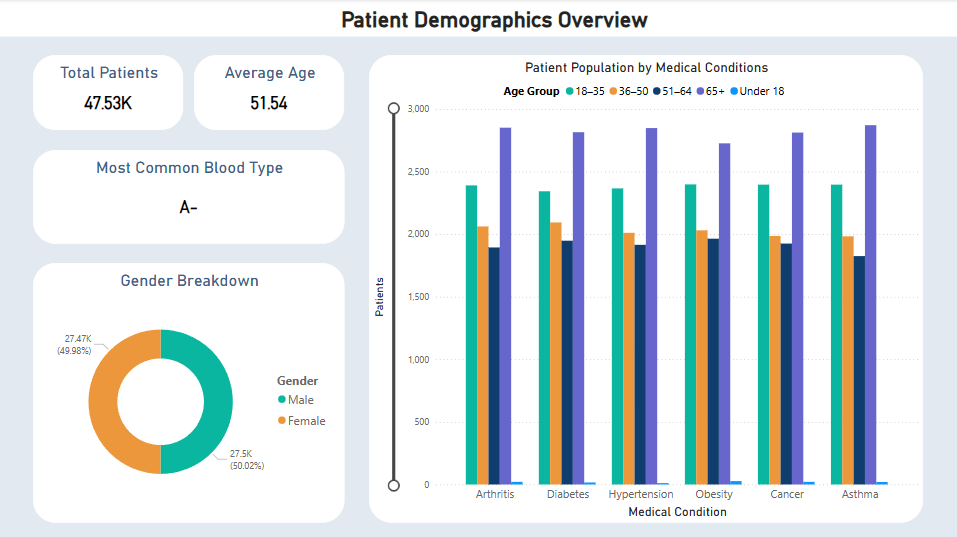
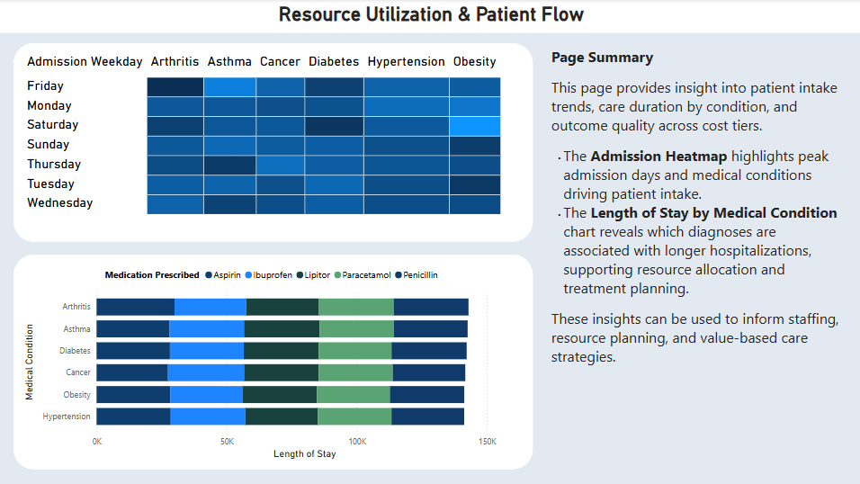

# Healthcare Analytics

Healthcare analytics project aimed at uncovering key trends and actionable insights from hospital patient admission data. This project leverages Python for data preprocessing and exploration, and Power BI for interactive visualization and reporting. It's designed as a showcase of real-world data analytics and reporting skills, suitable for professional portfolios.

## Project Overview

This project analyzes synthetic healthcare data, including patient demographics, diagnoses, treatments, admission types, and outcomes. The main goals are:

- To perform data cleaning and transformation in Python
- To explore trends in patient admissions and outcomes
- To visualize the insights using Power BI dashboards
- To deliver actionable recommendations for hospital operations and patient care

## Power BI Visualizations
A set of interactive visuals built to explore patient intake trends, care durations, and admission insights based on medical and operational data.

### 🔹 Admission Heatmap
    Shows the volume of patient admissions by weekday and medical condition, highlighting peak intake times across the week.

### 🔹 Length of Stay by Medical Condition
    Displays total hospitalization days per diagnosis, helping identify which conditions require longer care and more resources.

## Tools Used

- **Python**: Data preprocessing, exploration, and transformation.
- **Power BI**: Dashboard creation and data storytelling
- **Kaggle**: Data source (synthetic healthcare dataset)

## Dataset Information

- **Source**: Kaggle - [Healthcare Dataset](www.kaggle.com/datasets/prasad22/healthcare-dataset)
- **Records**: 50,000+
- **Fields**: Patient ID, Age, Gender, Admission Type, Diagnosis, Treatment, Length of Stay, Discharge Status

## Key Features in Dashboard

- Patient demographics breakdown
- Admission types and diagnosis trends
- Treatment outcomes and discharge summaries (pending...)
- Length of stay analysis by condition and patient type (pending...)
